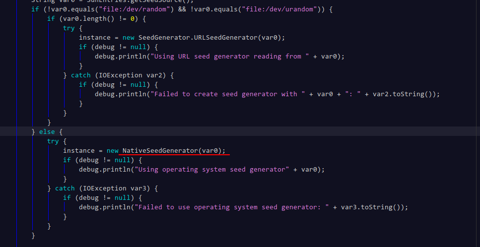
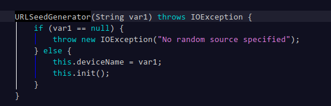

## java的随机数发生器

 -Djava.security.egd=file:/dev/random

 -Djava.security.egd=file:/dev/urandom

例：

java  -Djava.security.egd=file:/dev/random -jar xxx.jar

生成随机数时，在linux系统下(windows不明),需要调用系统本地方法生成高随机性的公钥或一次性密码本。

系统在生成密码本时，需要熵池中收集到了足够的环境噪声。如果没有足够的噪声时，

使用设备 /dev/random将会导致阻塞，但是随机数强度较高

使用设备 /dev/urandom不会导致阻塞

1.7 ? 之前有bug，即使使用了 -Djava.security.egd=file:/dev/urandom，最后起作用的是  

-Djava.security.egd=file:/dev/random

1.8从代码上看已经改了

类 ：SeedGenerator

以上是jdk1.8版本里边的截图。这几个图中，参数是一直传递过来的，所以是没有问题的。

